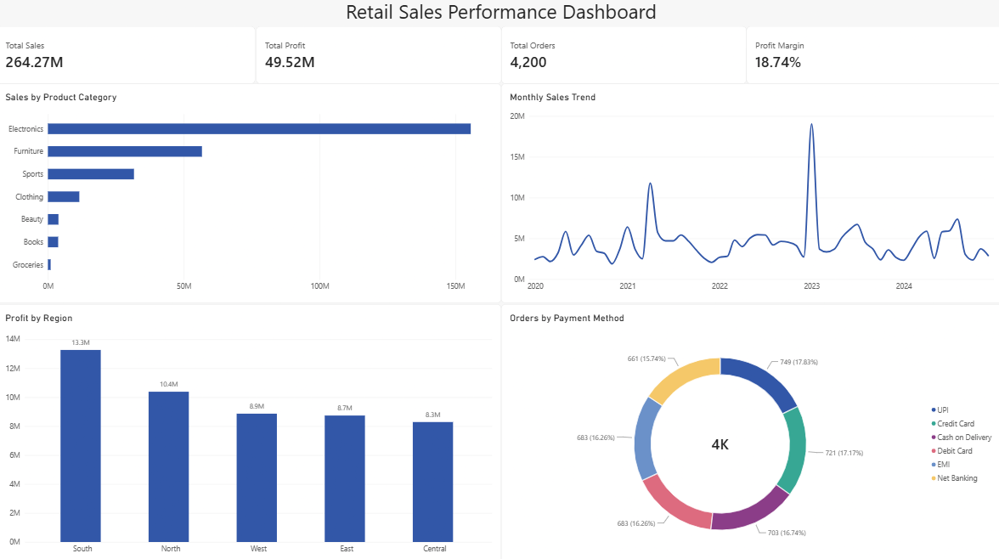

# Retail Sales Performance Dashboard

## Project Overview

This project analyzes retail sales data to evaluate overall sales performance, profitability, regional performance, product category performance, and customer purchasing patterns.

The goal was to transform a raw retail sales dataset into a cleaned and validated dataset and develop an interactive Power BI dashboard that answers key business questions and supports data-driven decision-making.

## Business Questions

- Which product categories generate the most sales and profit?
- Which regions are the most profitable?
- How have sales changed over time?
- Which payment methods are used most frequently?
- How do high-performing product categories compare in terms of sales volume and profitability?

## Tools Used

- **Microsoft Excel** — data exploration, validation, and PivotTable analysis
- **Power Query** — data cleaning and transformation
- **Power BI** — data modeling, DAX measures, interactive analysis, and dashboard development

## Data Cleaning & Preparation

Before building the dashboard, I performed a data quality audit in Excel and used Power Query to clean and prepare the dataset for analysis.

Key steps included:

- Standardized inconsistent date formats and converted the order date field to the appropriate date data type.
- Investigated repeated order IDs to distinguish duplicate records from potentially valid transactions.
- Validated duplicate records using grouped counts and row-level comparisons before removing confirmed duplicates.
- Identified missing values across multiple fields and evaluated whether they should be removed, retained, or replaced.
- Identified invalid age and quantity values and replaced values that could not be reliably validated with nulls rather than making unsupported assumptions.
- Standardized inconsistent categorical values, including gender labels and capitalization.
- Investigated customer IDs associated with multiple customer names instead of automatically overwriting uncertain records.
- Created a data quality audit to document identified issues, planned actions, and cleaning decisions.
- Used PivotTables to validate totals and explore sales, profit, orders, regions, and product categories before developing the Power BI dashboard.

## Dashboard KPIs

The final dashboard tracks four primary KPIs:

- **Total Sales:** $264.27M
- **Total Profit:** $49.52M
- **Total Orders:** 4,200
- **Profit Margin:** 18.74%

## Key Findings

- Electronics generated the highest sales at approximately **$155.64M** and the highest total profit at approximately **$19.11M**.
- The **South** was the most profitable region, generating approximately **$13.26M** in profit.
- Overall sales totaled approximately **$264.27M**, with **$49.52M** in profit and an overall profit margin of **18.74%**.
- Electronics accounted for **608 orders**. When the dashboard was filtered to Electronics, **Debit Card** was the most frequently used payment method.
- Although Electronics generated the highest sales and total profit, its profit margin was approximately **12.28%**, below the overall **18.74%** profit margin. This indicates that high sales volume does not necessarily translate into proportionally high profitability.
- The sales trend contains noticeable spikes, particularly around 2021 and 2023, which could warrant further investigation into promotional activity, unusually large transactions, or other underlying drivers.

## Business Recommendation

Electronics should not automatically receive additional investment solely because it generates the highest sales. Its lower profit margin suggests that the drivers of its sales volume and associated costs should be investigated first. Further analysis of discounting, pricing, product mix, and transaction-level profitability could identify opportunities to improve margins while preserving strong sales performance.

## Dashboard Preview

